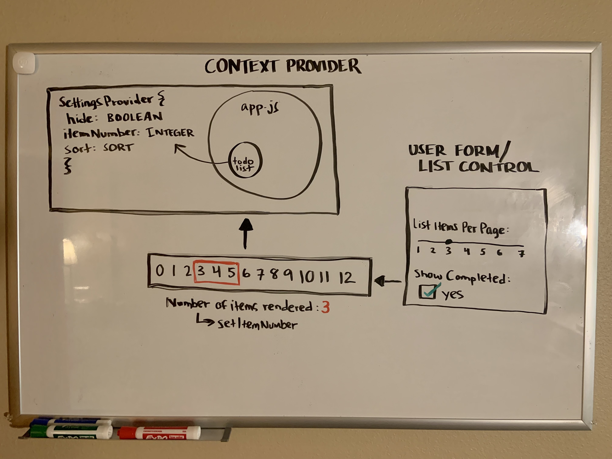

# To Do App

## Phase 1 Requirements

In Phase 1, we're going to perform some refactoring of the To Do application as built by another team. This application mixes application state and user settings at the top level and passes things around. It was a good proof of concept, but we need to make this production ready.

    Style the application using the Blueprint Component API{target:_blank}

    Properly modularize the application into separate components

    Implement the Context API to make some basic application settings available to components
        How many To Do Items to show at once
        Whether or not to show completed items

## Phase 2 Requirements

In Phase 2, we're going to extend the functionality of our application by allowing the user to make some decisions on how they would like the application to function. Specifically, we'll let them make changes to 2 settings.

    Implement the Context API to make some basic application settings available to components
        How many To Do Items to show at once
        Whether or not to show completed items
    Provide the users with a form where they can change the values for those settings
        This should be given in the form of a new component, perhaps linked to from the main navigation
        Hint: Use Browser Router to create the page/route/component for this
    Save the users choices in Local Storage
    Retrieve their preferences from Local Storage and apply them to the application on startup

## UML

## References

I worked alongside instructor Jacob Knaack on this project as he went through the problem domain during lecture. Chance Harmon (TA) also provided help.

Documentation for Blueprint styling was provided from their website, here:
https://blueprintjs.com/docs/#core

## Deployed URL

[Deployed Link Here](https://keen-jennings-328dbf.netlify.app/)